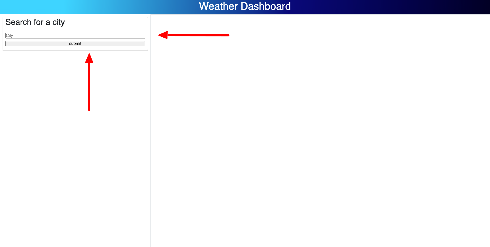
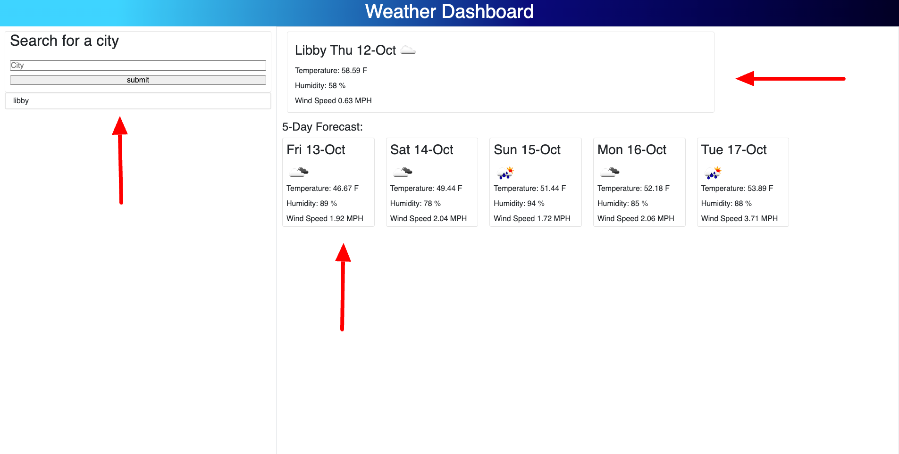

# weather-forcast

## Description

Users can search a city see its current weather such as temperature, humidity, and wind speed. This application was created to give users a simple view of their city of choices weather for the next 5 days.

## Usage

To get started follow link to the application.

https://markcurtiss720.github.io/weather-forcast/

once there enter a city you'd like to see what weather is going there today

the city you searched for is saved in the history for future veiwing and the current weather is populated as well as the next 5 days of weather.

## License

See license on github

---

🏆 The previous sections are the bare minimum, and your project will ultimately determine the content of this document. You might also want to consider adding the following sections.

## Badges

Badges aren't necessary, per se, but they demonstrate street cred. Badges let other developers know that you know what you're doing. Check out the badges hosted by [shields.io](https://shields.io/). You may not understand what they all represent now, but you will in time.

## Features

If your project has a lot of features, list them here.

## How to Contribute

If you created an application or package and would like other developers to contribute it, you can include guidelines for how to do so. The [Contributor Covenant](https://www.contributor-covenant.org/) is an industry standard, but you can always write your own if you'd prefer.

## Tests

Go the extra mile and write tests for your application. Then provide examples on how to run them here.